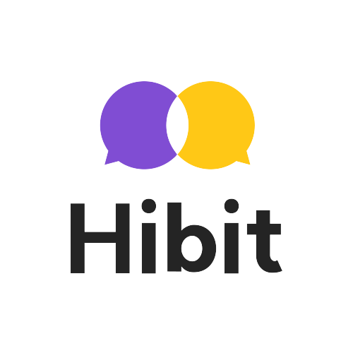
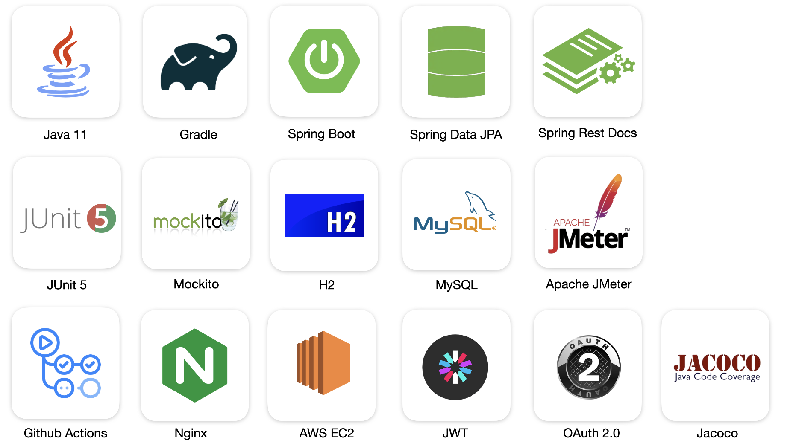
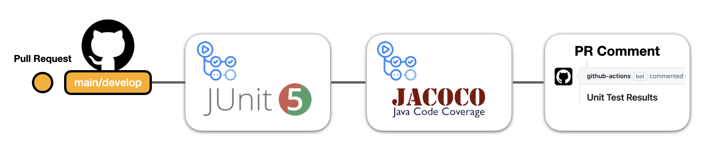
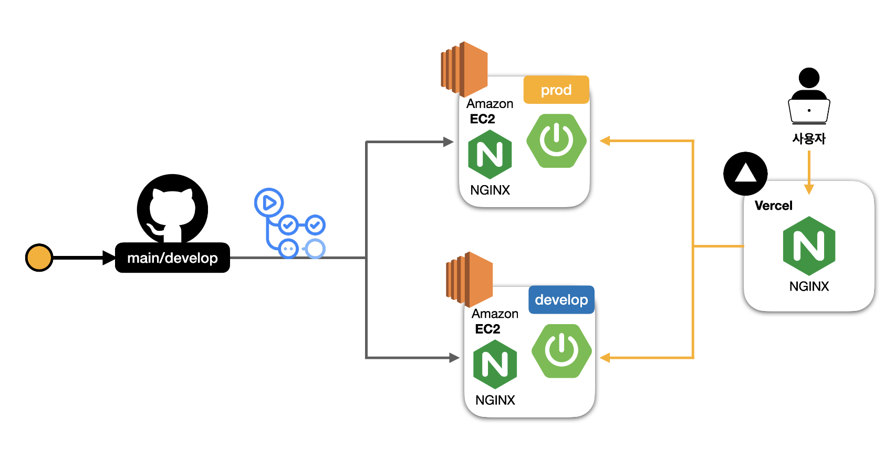

# Version2

📌 해당 Repository는 [hibit-backend](https://github.com/hibit-team/hibit-backend) 프로젝트를 기반으로 **개선 작업**을 진행하고 있는 저장소입니다.

현재는 백엔드의 코드와 인프라적인 구조를 고민하고 개선하는 작업을 진행하고 있습니다.

프로젝트 배포는 AWS를 통해 진행할 예정입니다.

기존 브랜치 전략은 `Git Flow` 정책을 사용하였는데, 현재 저장소에서는 `GitHub Flow`를 기반으로 Master와 Feature(Fix, Refactor, Docs) 브랜치로만 브랜치를 분류하여 운영하고 있습니다.

예술 기반의 소셜 디스커버리 🎨 서비스

히빗에 대한 서비스 소개를 더 자세히 알아보고 싶다면, [여기](https://ycat01.notion.site/28a5202c60344d978caa0d2745921049?pvs=4)를 클릭해주세요!

> [Version 1]에 대한 내용이 궁금하다면, [여기](https://github.com/hibit-team/hibit-backend)를 클릭해 주세요!

## 구현 기능

### 🧷 기능 1: `소셜 로그인` - 간편하게 로그인할 수 있어요.

- 자주 사용하는 소셜미디어 중 하나인 `구글` 계정으로 로그인/회원가입을 할 수 있어요.

### 🧷 기능 2. `프로필` - 상대방의 프로필 정보를 확인할 수 있어요.

- 매칭 시 필요한 프로필 정보를 입력할 수 있어요.
- 상대방에게 노출 되는 프로필 정보의 수준을 허용 가능한 범위 내에서 선택할 수 있어요.

### 🧷 기능 3. `게시글` - 본인이 원하는 상대방과 연결해줘요.

- 모집자로서 게시글을 작성하고 원하는 상대방에게 매칭 초대장을 전송할 수 있어요.
- 신규 등록한 게시글을 모두 확인할 수 있어요.
- 원하는 게시글을 키워드로 검색하여 확인할 수 있어요.

## 🛠 Tech Stacks

### Backend

## ⚙️ Infrastructure

